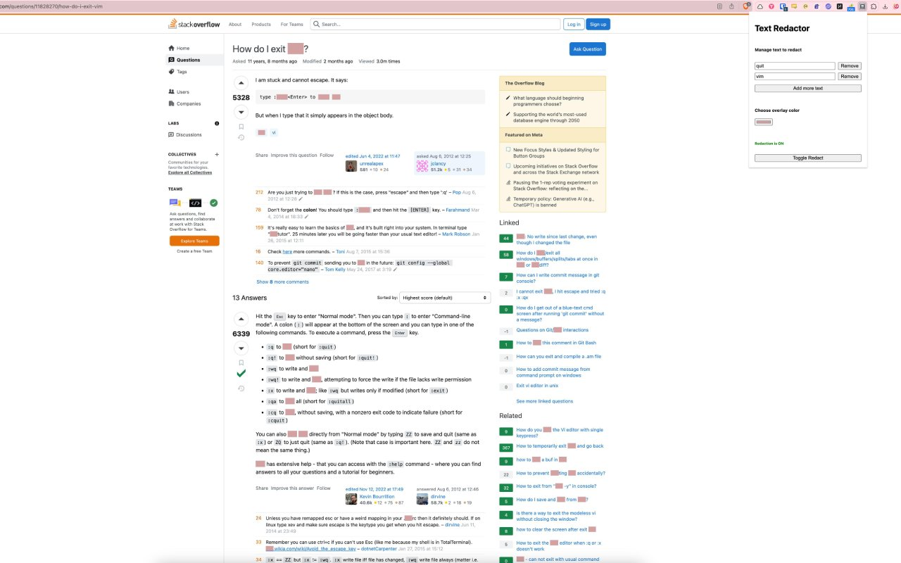

# Text Redactor

Text Redactor is a Chrome extension designed to enhance privacy and focus by allowing users to selectively hide text on web pages. This tool is perfect for users who need to conceal sensitive information or reduce visual clutter while browsing, or wanting to hide some text before taking a screenshot.

For more screenshots, see [screenshots folder](./assets/screenshots)

## Features

- **Text Hiding**: Redact text directly on web pages using customizable redaction settings. The redactor also works with **shadow-root** HTML elements, which is useful for redacting development error message.
- **Customizable Color Overlay**: Choose the color of your text overlay to blend with the page or stand out, according to your needs.
- **Dynamic Input Management**: Add and remove text phrases to be redacted directly through the extension's popup interface.
- **Toggle Redaction**: Easily switch redaction on or off with a single click to view original text or hide it as needed.
- **Save Preferences**: Your redaction settings (text phrases and color) are saved locally, so they persist across browsing sessions.

## Installation

1. Download the extension from the Chrome Web Store.
2. Navigate to `chrome://extensions` in your Chrome browser.
3. Ensure that the "Developer mode" toggle in the top right corner is turned on.
4. Click "Load unpacked" and select the extension folder that you downloaded.
5. The extension should now appear in your browser's extension toolbar.

## Usage

To use Text Redactor, click the extension icon in the Chrome toolbar to open the popup interface. From here:

1. **Add Text**: Click on "Add more text" to input new text phrases you want to redact.
2. **Set Color**: Use the color picker to choose the overlay color for the redaction.
3. **Activate**: Click "Toggle Redact" to activate or deactivate text redaction on the current page.
4. **Remove Text**: Next to each text input, there is a "Remove" button to delete unnecessary text entries.

## Contributing

Contributions are welcome! Please fork the repository and submit pull requests with your proposed changes. For major changes, please open an issue first to discuss what you would like to change.

## License

Distributed under the MIT License. See `LICENSE` for more information.

## Support

For support, open an issue in the GitHub repository.

Text Redactor is dedicated to providing a discreet and customizable browsing experience. Enjoy enhanced privacy and focus while you browse!
